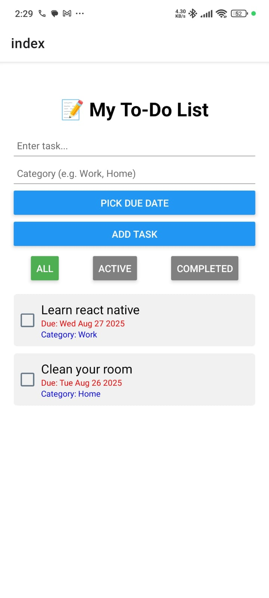
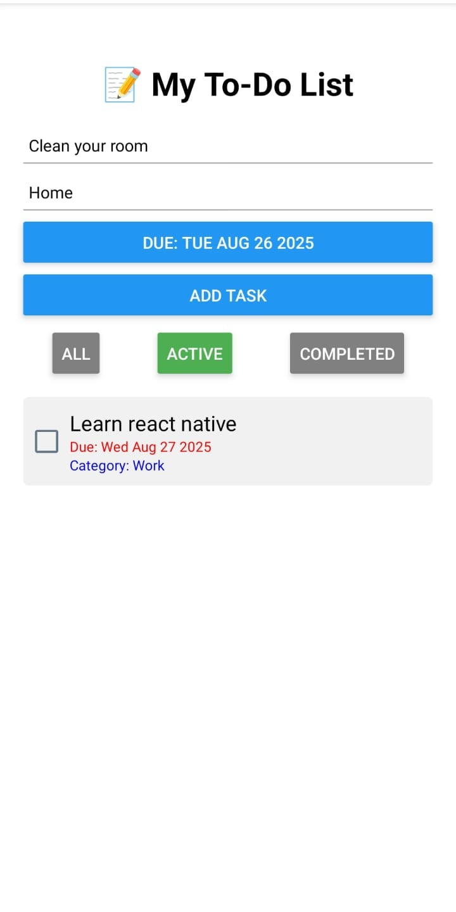
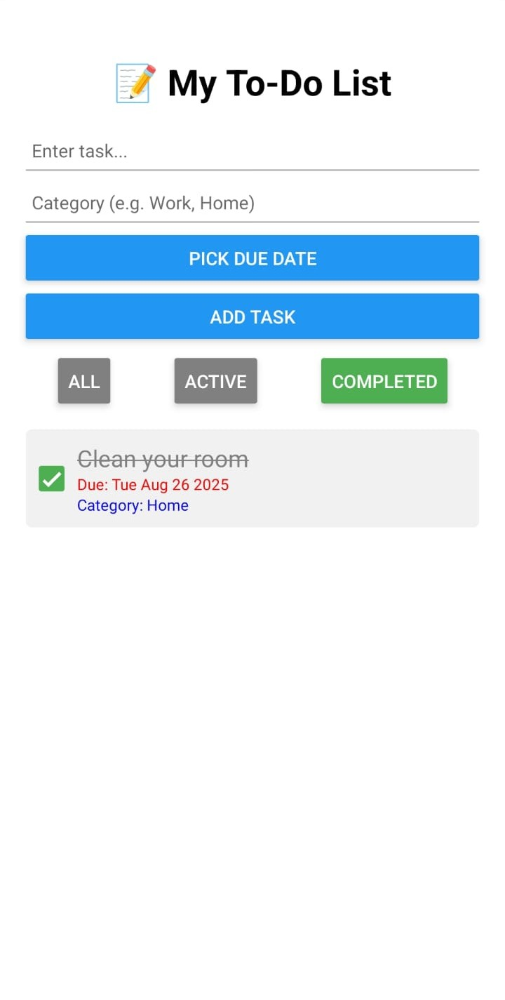

# 📝 React Native To-Do App  

A cross-platform **To-Do List mobile app** built with **React Native & Expo**.  
It helps users add, organize, and manage tasks with features like due dates, categories, filters, and swipe-to-delete.  

---

## 🚀 Features  

✅ Add tasks with **title, category, and due date**  
✅ Mark tasks as **completed** with a checkbox (strike-through styling)  
✅ **Filter tasks**: All / Active / Completed  
✅ **Swipe to delete** tasks  
✅ **Persist tasks** using AsyncStorage (data saved across sessions)  
✅ Runs on **iOS, Android, and web** (via Expo)  

---

## 📸 Screenshots  

| Home Screen | Adding Task | Completed + Filter |
|-------------|-------------|--------------------|
|  |  |  |


---

## 🛠 Tech Stack  

- **React Native** (UI framework)  
- **Expo** (development/build toolchain)  
- **Expo Router** (navigation)  
- **AsyncStorage** (persistent storage)  
- **Expo Checkbox** (checkbox component)  
- **React Native Gesture Handler** (swipe-to-delete)  
- **DateTimePicker** (due dates)  

---

## ⚡ Installation & Setup  

1. Clone the repo:
   ```bash
   git clone https://github.com/27Adityasahil/to-do-application.git
   cd todo-app
2. Install dependencies:
   ```bash
   npm install
3. Start the Expo development server:
   ```bash
   npx expo start
4. Scan the QR code with Expo Go (Android/iOS) or run on an emulator.
